<!-- Spanish version of README.md. Animated assets are generated by scripts/build-assets.mjs -->

  <a href="https://github.com/TillardFranco"><picture><source media="(prefers-color-scheme: dark)" srcset="./assets/lang/es-dark.svg"></picture></a>

<a href="https://forestgreen-kingfisher-459506.hostingersite.com/">
  <picture>
    <source media="(prefers-color-scheme: dark)" srcset="./assets/es/hero-dark.svg">
    
  </picture>
</a>

  <a href="https://forestgreen-kingfisher-459506.hostingersite.com/"><picture><source media="(prefers-color-scheme: dark)" srcset="./assets/es/buttons/portfolio-dark.svg"></picture></a>
  <a href="https://linkedin.com/in/tillardfrancotomas"><picture><source media="(prefers-color-scheme: dark)" srcset="./assets/es/buttons/linkedin-dark.svg"></picture></a>
  <a href="mailto:tillardtomasfranco@gmail.com"><picture><source media="(prefers-color-scheme: dark)" srcset="./assets/es/buttons/email-dark.svg"></picture></a>

## Sobre mí

Desarrollador FullStack y estudiante de último año de **Ingeniería en Software** en la Universidad Siglo 21. Construyo productos web con React, Java y Spring Boot, de la idea a producción.

- **Desarrollador Analista en MetroTec** (desde feb. 2026). Convierto requerimientos funcionales de unas 30 empresas cliente en software funcionando, y valido cada especificación contra la base de datos real antes de escribir código.
- **Cofundador de Dev.Bit**, un estudio de software que desarrolla sitios web y sistemas para pequeñas empresas.

**Actualmente** desarrollo Farmaser, un e-commerce para farmacias con Spring Boot y React, y profundizo en microservicios y rendimiento backend.

**Abierto a** equipos de producto que construyan software desde cero con tecnologías modernas.

## Stack

<picture>
  <source media="(prefers-color-scheme: dark)" srcset="./assets/stack-dark.svg">
  
</picture>

<table>
  <tr>
    <td><b>Frontend</b></td>
    <td><code>React</code> <code>TypeScript</code> <code>JavaScript</code> <code>Vite</code> <code>Tailwind CSS</code> <code>HTML</code> <code>CSS</code></td>
  </tr>
  <tr>
    <td><b>Backend</b></td>
    <td><code>Java</code> <code>Spring Boot</code> <code>Spring Security</code> <code>JWT</code> <code>Node.js</code> <code>APIs REST</code></td>
  </tr>
  <tr>
    <td><b>Datos y herramientas</b></td>
    <td><code>MySQL</code> <code>PostgreSQL</code> <code>Maven</code> <code>Git</code> <code>GitHub</code> <code>Jira</code> <code>Notion</code></td>
  </tr>
</table>

## Proyectos destacados

<table>
  <tr>
    <td>
      
      <h3>Dev.Bit</h3>
      
Sitio web del estudio de software que cofundé, con servicios, portfolio de clientes y formulario de contacto.

      
<code>React</code> <code>React Router</code> <code>Tailwind CSS</code>

      
<a href="https://www.devbitsoftware.com/"><b>Ver sitio ↗</b></a>

    </td>
  </tr>
  <tr>
    <td>
      
      <h3>Farmaser</h3>
      
E-commerce y sistema de gestión para farmacias: stock, ventas, clientes y pagos con Mercado Pago. En desarrollo.

      
<code>Java</code> <code>Spring Boot</code> <code>Spring Security</code> <code>JWT</code> <code>MySQL</code> <code>React</code>

    </td>
  </tr>
  <tr>
    <td>
      
      <h3>Sistema de gestión interno</h3>
      
Backend ERP genérico y modular construido con Spring Boot 3 y Java 17. Inventario, ventas y gestión para comercios.

      
<code>Java</code> <code>Spring Boot</code> <code>Spring Data JPA</code> <code>MapStruct</code> <code>MySQL</code>

      
<a href="https://github.com/TillardFranco/Sistema-Gestion-Backend-ERP"><b>Código fuente ↗</b></a>

    </td>
  </tr>
</table>

  
<b>Trabajo para clientes de Dev.Bit</b> (4 sitios)

   
  <table>
    <tr>
      <td width="50%" valign="top">
        
        <h4>Aires del Lago</h4>
        Landing page para un complejo de cabañas con reservas online. 
        <code>React</code> <code>Vite</code> <code>Tailwind CSS</code> 
        <a href="https://airesdellagolosmolinos.com.ar">Ver sitio ↗</a>
      </td>
      <td width="50%" valign="top">
        
        <h4>ORIGEN</h4>
        Tienda de ropa streetwear con catálogo, carrito y pedidos por WhatsApp. 
        <code>React</code> <code>Vite</code> <code>JavaScript</code> 
        <a href="https://origenoficial.com.ar">Ver sitio ↗</a>
      </td>
    </tr>
    <tr>
      <td width="50%" valign="top">
        
        <h4>Ana Gottardi</h4>
        Sitio de pastelería artesanal con catálogo, carrito de pedidos y pedidos por WhatsApp. 
        <code>React</code> <code>Vite</code> <code>CSS Modules</code> 
        <a href="https://anagottardi.com.ar">Ver sitio ↗</a>
      </td>
      <td width="50%" valign="top">
        
        <h4>Dra. Ávila Consultorios</h4>
        Sitio para un centro médico con sistema de turnos online integrado. 
        <code>React</code> <code>Vite</code> <code>CSS Modules</code> 
        <a href="https://drasavila-consultorios.ar">Ver sitio ↗</a>
      </td>
    </tr>
  </table>

 

<picture>
  <source media="(prefers-color-scheme: dark)" srcset="./assets/es/motto-dark.svg">
  
</picture>
