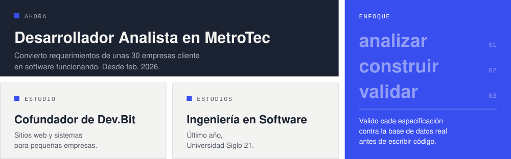

<!-- Spanish version of README.md. Assets are generated by scripts/build-assets.mjs -->

<p align="right">
  <a href="https://github.com/TillardFranco"><picture><source media="(prefers-color-scheme: dark)" srcset="./assets/lang/es-dark.svg"></picture></a>
</p>

<a href="https://francotillard.vercel.app/">
  <picture><source media="(prefers-color-scheme: dark)" srcset="./assets/hero-es-dark.svg"></picture>
</a>

<p>
  <a href="https://francotillard.vercel.app/"><picture><source media="(prefers-color-scheme: dark)" srcset="./assets/keys/portfolio-es-dark.svg"></picture></a>
  <a href="https://linkedin.com/in/tillardfrancotomas"><picture><source media="(prefers-color-scheme: dark)" srcset="./assets/keys/linkedin-es-dark.svg"></picture></a>
  <a href="mailto:tillardtomasfranco@gmail.com"><picture><source media="(prefers-color-scheme: dark)" srcset="./assets/keys/email-es-dark.svg"></picture></a>
</p>

## ~/sobre-mi

<picture><source media="(prefers-color-scheme: dark)" srcset="./assets/about-es-dark.svg"></picture>

## ~/stack

```text
stack/
├── frontend/       react  typescript  javascript  vite  tailwind  html  css
├── backend/        java  spring-boot  spring-security  jwt  node  apis-rest
├── datos/          mysql  postgresql
└── herramientas/   maven  git  github  jira  notion
```

## ~/proyectos

<table>
  <tr>
    <td colspan="2" valign="top">
      <a href="https://www.devbitsoftware.com/"></a>
      <h3><code>devbit/</code></h3>
      Sitio web del estudio de software que cofundé, con servicios, portfolio de clientes y formulario de contacto.<br><br>
      <code>react</code> <code>react-router</code> <code>tailwind</code> &nbsp; <a href="https://www.devbitsoftware.com/">→ ver sitio</a>
    </td>
  </tr>
  <tr>
    <td width="50%" valign="top">
      <p align="center"></p>
      <h3><code>farmaser/</code></h3>
      E-commerce y sistema de gestión para farmacias: stock, ventas, clientes y pagos con Mercado Pago. En desarrollo.<br><br>
      <code>java</code> <code>spring-boot</code> <code>spring-security</code> <code>jwt</code> <code>mysql</code> <code>react</code>
    </td>
    <td width="50%" valign="top">
      <a href="https://github.com/TillardFranco/Sistema-Gestion-Backend-ERP"></a>
      <h3><code>erp-backend/</code></h3>
      Backend ERP genérico y modular construido con Spring Boot 3 y Java 17. Inventario, ventas y gestión para comercios.<br><br>
      <code>java</code> <code>spring-boot</code> <code>spring-data-jpa</code> <code>mapstruct</code> <code>mysql</code><br><br>
      <a href="https://github.com/TillardFranco/Sistema-Gestion-Backend-ERP">→ código fuente</a>
    </td>
  </tr>
</table>

<details>
  <summary><code>ls ~/proyectos/clientes-dev.bit</code> (4 sitios)</summary>
  <br>
  <table>
    <tr>
      <td width="50%" valign="top">
        <a href="https://airesdellagolosmolinos.com.ar"></a>
        <h4><code>aires-del-lago/</code></h4>
        Landing page para un complejo de cabañas con reservas online.<br>
        <code>react</code> <code>vite</code> <code>tailwind</code><br>
        <a href="https://airesdellagolosmolinos.com.ar">→ ver sitio</a>
      </td>
      <td width="50%" valign="top">
        <a href="https://origenoficial.com.ar"></a>
        <h4><code>origen/</code></h4>
        Tienda de ropa streetwear con catálogo, carrito y pedidos por WhatsApp.<br>
        <code>react</code> <code>vite</code> <code>javascript</code><br>
        <a href="https://origenoficial.com.ar">→ ver sitio</a>
      </td>
    </tr>
    <tr>
      <td width="50%" valign="top">
        <a href="https://anagottardi.com.ar"></a>
        <h4><code>ana-gottardi/</code></h4>
        Sitio de pastelería artesanal con catálogo, carrito de pedidos y pedidos por WhatsApp.<br>
        <code>react</code> <code>vite</code> <code>css-modules</code><br>
        <a href="https://anagottardi.com.ar">→ ver sitio</a>
      </td>
      <td width="50%" valign="top">
        <a href="https://drasavila-consultorios.ar"></a>
        <h4><code>dra-avila/</code></h4>
        Sitio para un centro médico con sistema de turnos online integrado.<br>
        <code>react</code> <code>vite</code> <code>css-modules</code><br>
        <a href="https://drasavila-consultorios.ar">→ ver sitio</a>
      </td>
    </tr>
  </table>
</details>

<br>

<picture><source media="(prefers-color-scheme: dark)" srcset="./assets/meadow-dark.svg"></picture>
