<!-- Terminal assets are generated by scripts/build-assets.mjs -->

<p align="right">
  <a href="./README.es.md"></a>
</p>

<a href="https://forestgreen-kingfisher-459506.hostingersite.com/">
  
</a>

<p>
  <a href="https://forestgreen-kingfisher-459506.hostingersite.com/"></a>
  <a href="https://linkedin.com/in/tillardfrancotomas"></a>
  <a href="mailto:tillardtomasfranco@gmail.com"></a>
</p>

## ~/about

```ts
const franco = {
  role: "FullStack Developer",
  studies: "Software Engineering, Universidad Siglo 21 (final year)",
  work: [
    { at: "MetroTec", as: "Analyst Developer", since: "2026-02" },
    { at: "Dev.Bit", as: "Co-founder" },
  ],
  // I validate every spec against the real database before writing code.
  approach: ["analyze", "build", "validate"],
  learning: ["microservices", "backend performance"],
  openTo: "product teams building software from scratch with modern stacks",
};
```

## ~/stack

```text
stack/
├── frontend/   react  typescript  javascript  vite  tailwind  html  css
├── backend/    java  spring-boot  spring-security  jwt  node  rest-apis
├── data/       mysql  postgresql
└── tools/      maven  git  github  jira  notion
```

## ~/projects

<table>
  <tr>
    <td width="300" valign="top">
      <a href="https://www.devbitsoftware.com/"></a>
    </td>
    <td valign="top">
      <h3><code>devbit/</code></h3>
      Website for the software studio I co-founded, with services, client portfolio and contact form.<br><br>
      <code>react</code> <code>react-router</code> <code>tailwind</code><br><br>
      <a href="https://www.devbitsoftware.com/">→ live site</a>
    </td>
  </tr>
  <tr>
    <td width="300" align="center" valign="middle">
      
    </td>
    <td valign="top">
      <h3><code>farmaser/</code></h3>
      Pharmacy e-commerce and management system: stock, sales, customers and Mercado Pago payments. In development.<br><br>
      <code>java</code> <code>spring-boot</code> <code>spring-security</code> <code>jwt</code> <code>mysql</code> <code>react</code>
    </td>
  </tr>
  <tr>
    <td width="300" valign="top">
      <a href="https://github.com/TillardFranco/Sistema-Gestion-Backend-ERP"></a>
    </td>
    <td valign="top">
      <h3><code>erp-backend/</code></h3>
      Generic, modular ERP backend built with Spring Boot 3 and Java 17. Inventory, sales and management for retail businesses.<br><br>
      <code>java</code> <code>spring-boot</code> <code>spring-data-jpa</code> <code>mapstruct</code> <code>mysql</code><br><br>
      <a href="https://github.com/TillardFranco/Sistema-Gestion-Backend-ERP">→ source code</a>
    </td>
  </tr>
</table>

<details>
  <summary><code>ls ~/projects/dev.bit-clients</code> (4 sites)</summary>
  <br>
  <table>
    <tr>
      <td width="50%" valign="top">
        <a href="https://airesdellagolosmolinos.com.ar"></a>
        <h4><code>aires-del-lago/</code></h4>
        Landing page for a cabin complex with online booking.<br>
        <code>react</code> <code>vite</code> <code>tailwind</code><br>
        <a href="https://airesdellagolosmolinos.com.ar">→ live site</a>
      </td>
      <td width="50%" valign="top">
        <a href="https://origenoficial.com.ar"></a>
        <h4><code>origen/</code></h4>
        Streetwear store with catalog, cart and orders through WhatsApp.<br>
        <code>react</code> <code>vite</code> <code>javascript</code><br>
        <a href="https://origenoficial.com.ar">→ live site</a>
      </td>
    </tr>
    <tr>
      <td width="50%" valign="top">
        <a href="https://anagottardi.com.ar"></a>
        <h4><code>ana-gottardi/</code></h4>
        Artisan bakery site with catalog, order cart and WhatsApp orders.<br>
        <code>react</code> <code>vite</code> <code>css-modules</code><br>
        <a href="https://anagottardi.com.ar">→ live site</a>
      </td>
      <td width="50%" valign="top">
        <a href="https://drasavila-consultorios.ar"></a>
        <h4><code>dra-avila/</code></h4>
        Medical center site with integrated online appointment booking.<br>
        <code>react</code> <code>vite</code> <code>css-modules</code><br>
        <a href="https://drasavila-consultorios.ar">→ live site</a>
      </td>
    </tr>
  </table>
</details>
