<!-- Animated assets are generated by scripts/build-assets.mjs -->

<a href="https://forestgreen-kingfisher-459506.hostingersite.com/">
  <picture>
    <source media="(prefers-color-scheme: dark)" srcset="./assets/hero-dark.svg">
    
  </picture>
</a>

  <a href="https://forestgreen-kingfisher-459506.hostingersite.com/"><picture><source media="(prefers-color-scheme: dark)" srcset="./assets/buttons/portfolio-dark.svg"></picture></a>
  <a href="https://linkedin.com/in/tillardfrancotomas"><picture><source media="(prefers-color-scheme: dark)" srcset="./assets/buttons/linkedin-dark.svg"></picture></a>
  <a href="mailto:tillardtomasfranco@gmail.com"><picture><source media="(prefers-color-scheme: dark)" srcset="./assets/buttons/email-dark.svg"></picture></a>

## About me

FullStack developer and final-year **Software Engineering** student at Universidad Siglo 21. I build web products with React, Java and Spring Boot, from idea to production.

- **Analyst Developer at MetroTec** (since Feb 2026). I turn functional requirements from about 30 client companies into working software, and I validate every spec against the real database before writing code.
- **Co-founder of Dev.Bit**, a software studio that builds websites and systems for small businesses.

**Currently** building Farmaser, a pharmacy e-commerce on Spring Boot and React, and going deeper into microservices and backend performance.

**Open to** product teams building software from scratch with modern stacks.

## Stack

<picture>
  <source media="(prefers-color-scheme: dark)" srcset="./assets/stack-dark.svg">
  
</picture>

<table>
  <tr>
    <td><b>Frontend</b></td>
    <td><code>React</code> <code>TypeScript</code> <code>JavaScript</code> <code>Vite</code> <code>Tailwind CSS</code> <code>HTML</code> <code>CSS</code></td>
  </tr>
  <tr>
    <td><b>Backend</b></td>
    <td><code>Java</code> <code>Spring Boot</code> <code>Spring Security</code> <code>JWT</code> <code>Node.js</code> <code>REST APIs</code></td>
  </tr>
  <tr>
    <td><b>Data &amp; tools</b></td>
    <td><code>MySQL</code> <code>PostgreSQL</code> <code>Maven</code> <code>Git</code> <code>GitHub</code> <code>Jira</code> <code>Notion</code></td>
  </tr>
</table>

## Selected projects

<table>
  <tr>
    <td>
      
      <h3>Dev.Bit</h3>
      
Website for the software studio I co-founded, with services, client portfolio and contact form.

      
<code>React</code> <code>React Router</code> <code>Tailwind CSS</code>

      
<a href="https://www.devbitsoftware.com/"><b>Live site ↗</b></a>

    </td>
  </tr>
  <tr>
    <td>
      
      <h3>Farmaser</h3>
      
Pharmacy e-commerce and management system: stock, sales, customers and Mercado Pago payments. In development.

      
<code>Java</code> <code>Spring Boot</code> <code>Spring Security</code> <code>JWT</code> <code>MySQL</code> <code>React</code>

    </td>
  </tr>
  <tr>
    <td>
      
      <h3>Internal management system</h3>
      
Generic, modular ERP backend built with Spring Boot 3 and Java 17. Inventory, sales and management for retail businesses.

      
<code>Java</code> <code>Spring Boot</code> <code>Spring Data JPA</code> <code>MapStruct</code> <code>MySQL</code>

      
<a href="https://github.com/TillardFranco/Sistema-Gestion-Backend-ERP"><b>Source code ↗</b></a>

    </td>
  </tr>
</table>

  
<b>Dev.Bit client work</b> (4 sites)

   
  <table>
    <tr>
      <td width="50%" valign="top">
        
        <h4>Aires del Lago</h4>
        Landing page for a cabin complex with online booking. 
        <code>React</code> <code>Vite</code> <code>Tailwind CSS</code> 
        <a href="https://airesdellagolosmolinos.com.ar">Live site ↗</a>
      </td>
      <td width="50%" valign="top">
        
        <h4>ORIGEN</h4>
        Streetwear store with catalog, cart and orders through WhatsApp. 
        <code>React</code> <code>Vite</code> <code>JavaScript</code> 
        <a href="https://origenoficial.com.ar">Live site ↗</a>
      </td>
    </tr>
    <tr>
      <td width="50%" valign="top">
        
        <h4>Ana Gottardi</h4>
        Artisan bakery site with catalog, order cart and WhatsApp orders. 
        <code>React</code> <code>Vite</code> <code>CSS Modules</code> 
        <a href="https://anagottardi.com.ar">Live site ↗</a>
      </td>
      <td width="50%" valign="top">
        
        <h4>Dra. Ávila Consultorios</h4>
        Medical center site with integrated online appointment booking. 
        <code>React</code> <code>Vite</code> <code>CSS Modules</code> 
        <a href="https://drasavila-consultorios.ar">Live site ↗</a>
      </td>
    </tr>
  </table>

 

<picture>
  <source media="(prefers-color-scheme: dark)" srcset="./assets/motto-dark.svg">
  
</picture>
